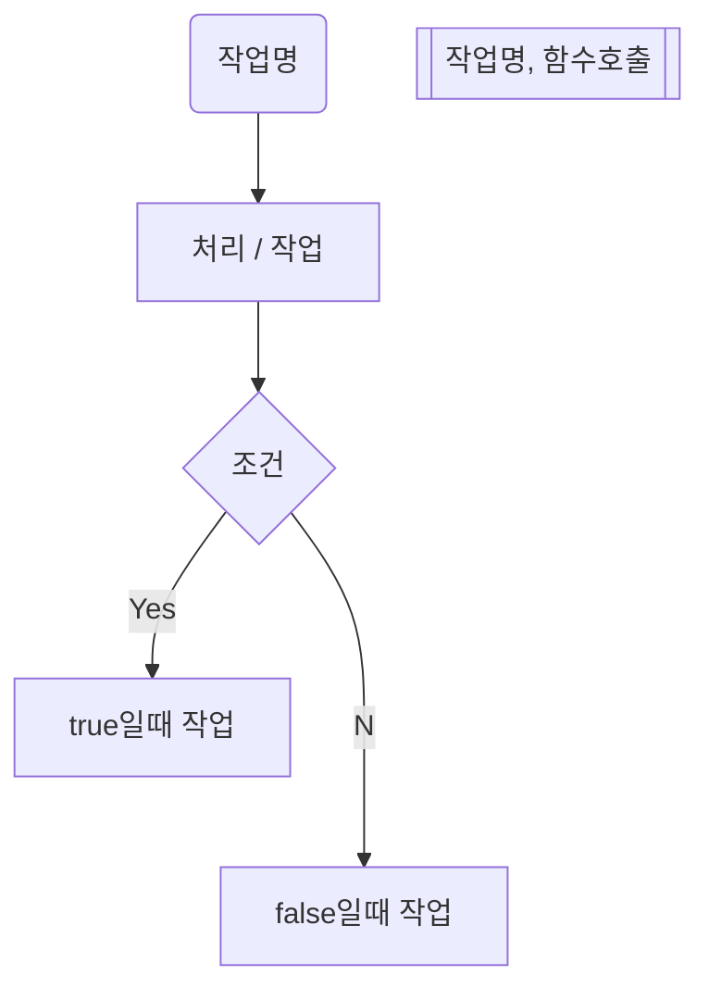

# Algorithm

- 좋은 회사 가려면 알아야하는 것?
  - 정형화된 알고리즘
- 문제를 해결하기 위한 일련의 단계적 절차
- 흐름
- 알고리즘에서 중요 시 해야할, 흐름을 만듬에 있어서 중점에 두어야 할 것
  - 정확도
  - 시간
  - 메모리효율

```mermaid
flowchart TB

E(작업명) --> A
A[처리 / 작업] --> B{조건}
B --Yes--> C[true일때 작업]
B --No--> D[false일때 작업]
F[[작업명, 함수호출]]

```
