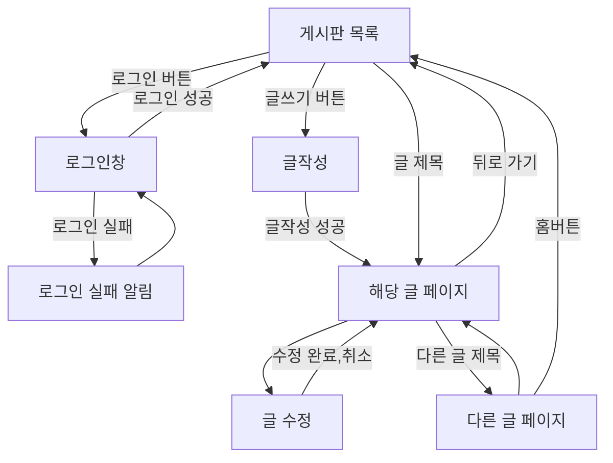
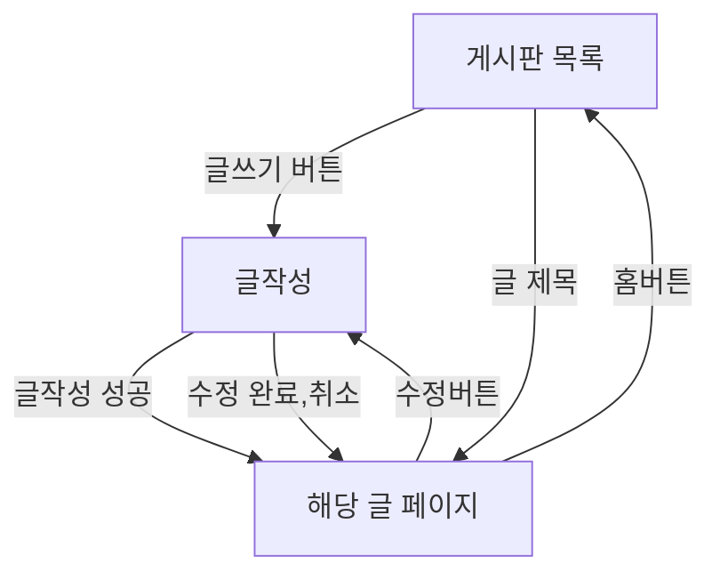

# 프로그래밍

1. 설계

   - 게시판을 만들자
   - 로그인
   - 글쓰기
     - 올라오는 글은 어떤 정보를 갖고있는지?
   - 댓글창
   - 목록
   - 회원가입
   - 추천
   - 날짜
   - 검색
   - 카테고리
   - 페이징

## 위를 봤을 때 흐름은?

- 게시글 목록

  - 출력 방법(V)
    - html, css, js
    - table
      - table 엘리먼트 사용법
    - ul
    - div
      - grid
  - 헤더 목록
    - (번호)
    - 제목
    - 글쓴이
    - (작성일)
    - (조회수)
    - (추천수)
  - 저장방법(M)
    - 로컬스토리지 이용

- 글 작성
  - 출력 방법(V)
  - 작성 가능 목록
    - 글쓴이
    - 제목
    - 내용
  - 작성 불가능 목록
    - (작성일)
    - (조회수)
    - (추천수)

2. 구현

   1. 게시글 목록
   2. 글작성
   3. 게시물 페이지

3. 테스트
   1. 게시글 목록
